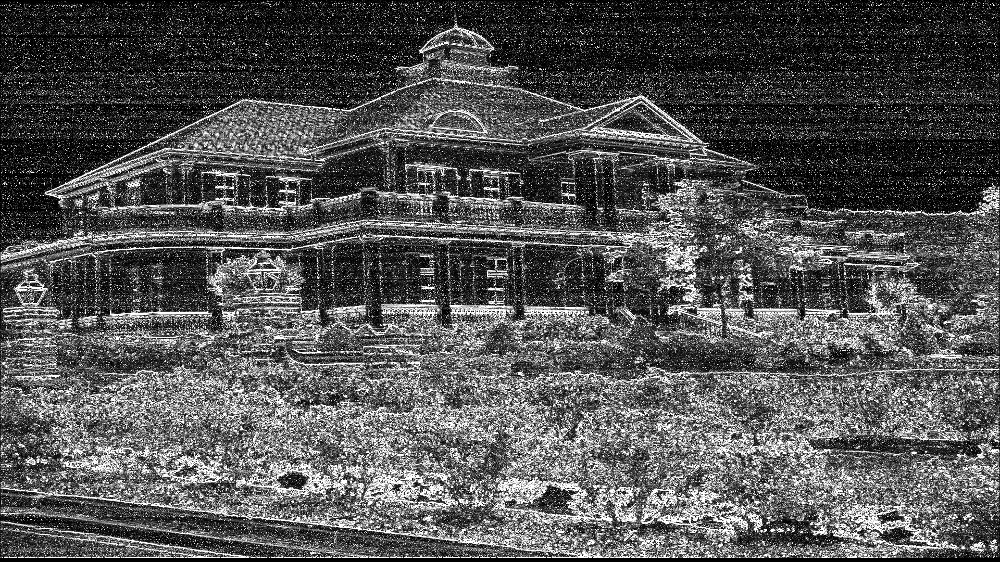
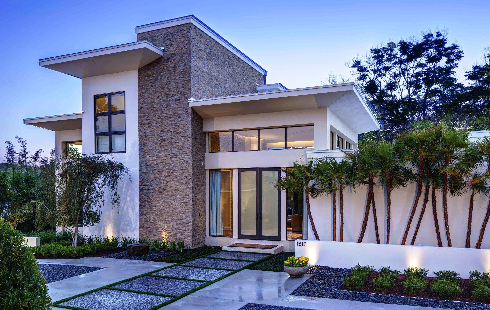

# 
Image Filter - Sobel

According to what you want to do, you have two options to run this project:

1. Apply the filter to only one Image.
2. Apply the filter to the images within a folder and get a time register file for each image.

---

## One image
In order to apply the sobel filter to an image and get an output file with the image filtered, you have to follow the next steps:
1) Open a terminal and go to the folder containing the project.
2) Run the program
   a) If you want to run the sequential program:
   - Run `Make`
   - Run `./practica` followed by the path of the image you want to apply the filter, then the path of the output file. The line would be:
    `./practica <path/image/to/filter.jpg> <path/filtered/image.jpg>`
     
        > **Example:**
            `Make`
            `./practica image.jpg imageFiltered.jpg`
            &nbsp;
              

    
    b. If you want to run the program using threads:

    - Run `Make practicaHilos`
   - Run `./practicaHilos` followed by the path of the image you want to apply the filter, then the path of the output file and finally the number of threads you want to use. The line would be:
    `./practica <path/image/to/filter.jpg> <path/filtered/image.jpg> <#Threads>`
     
        > **Example:**
            `Make practicaHilos`
            `./practicaHilos image.jpg imageFiltered.jpg 4`
            &nbsp;
              

## Many images
In order to apply the sobel filter to many images within a folder, get the output images, and get a register of execution time per image, you have to follow the next steps:
1. Open a terminal and go to the folder containing the project.
2. Create a folder called `images`. All the images you want to apply the filter will go here.
4. Run `bash run.sh` followed by the ...
